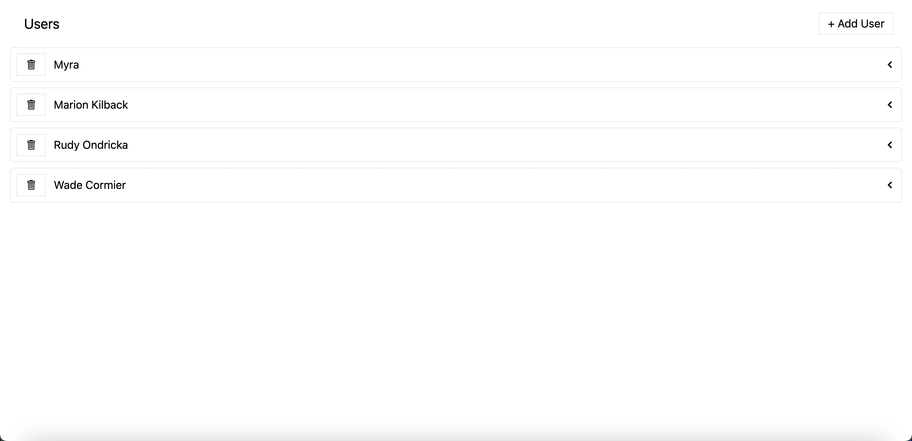
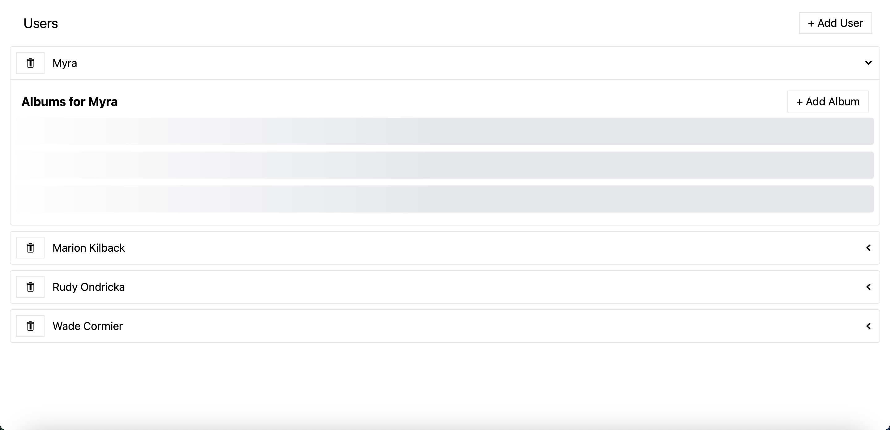
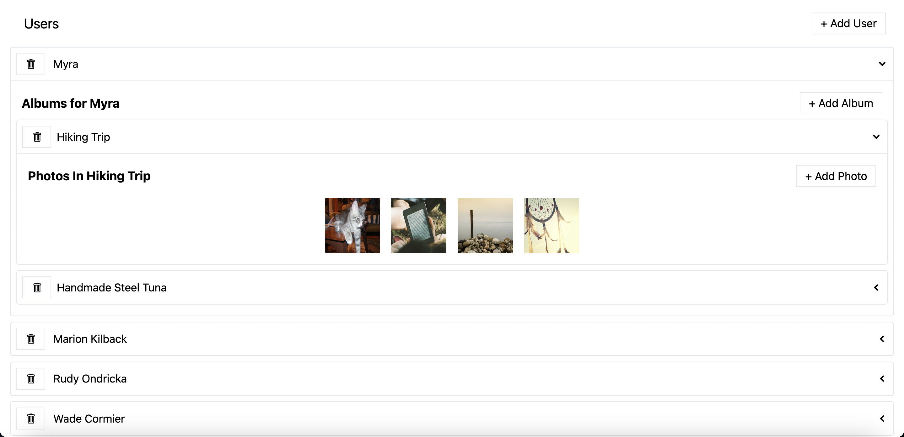

# Media







Features:

- Create User
- Add a personal album
- Save photo

### Install packages

In two separate terminal windows, run the following commands:

Terminal Window 1:

```bash
npm start
```

Terminal Window 2:

```bash
npm run start:server
```